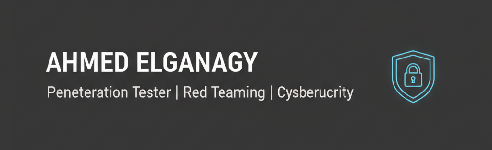

# Ahmed Elganagy
Red Team Trainee | Junior Penetration Tester

I am a cybersecurity practitioner focused on penetration testing, red teaming, and network and web security. I have developed a strong technical foundation through structured training programs such as the NTI Red Team Track, the Digital Egypt Pioneers Initiative (DEPI), the Information Technology Institute (ITI) cybersecurity program, and the Commercial International Bank (CIB) cybersecurity internship.

My learning journey is driven by hands-on practice, continuous improvement, and building real offensive security skills. I am currently working on structured pentesting labs, network enumeration scripts, and web application vulnerability writeups to strengthen my technical capabilities and create practical, documented projects.

---

## Technical Skills
- Penetration Testing and Vulnerability Assessment  
- Network Security and Linux Administration  
- Red Team Operations  
- Web Application Security  
- Python Scripting and Automation  
- Common Security Tools: Kali Linux, Burp Suite, Nmap, Wireshark  

---

## Training and Experience
- NTI – Red Team Trainee (2025 – Present)  
- Digital Egypt Pioneers Initiative (DEPI) – Penetration Testing & Vulnerability Analysis  
- ITI – Cybersecurity Trainee  
- CIB – Cybersecurity Intern  

These programs helped me build both technical and professional skills, including communication, teamwork, problem-solving, leadership, and project coordination.

---

## Projects
Below are selected repositories highlighting my practical work:

- **pentest-lab**  
  Documented offensive security labs, including reconnaissance, enumeration, exploitation, and remediation notes.

- **web-app-pentest-writeups**  
  Structured writeups demonstrating common web vulnerabilities with step-by-step reproduction and mitigation.

- **network-enum-scripts**  
  Python and Bash scripts designed to automate initial network enumeration tasks.

More repositories and practical demonstrations will be added as I continue progressing in my red team roadmap.

---

## Interests
- Penetration Testing  
- Red Teaming and Adversary Simulation  
- Network and Web Security  
- Scripting for Offensive Security  
- Continuous Learning and Skill Development  

---

## Contact
LinkedIn: https://www.linkedin.com/in/ahmedelganagy/  
Email: ahmedelganagy22@gmail.com

---

## CV

---

## Portfolio
Check out my hands-on cybersecurity projects and skills here: [Ahmed Elganagy Portfolio](https://ahmed-elganagy-portfolio.netlify.app/)

